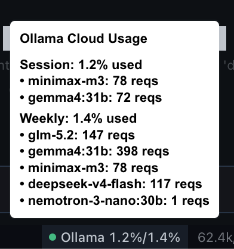

# Ollama Cloud Quota — Hermes Desktop Plugin

A [Hermes Agent](https://hermes-agent.nousresearch.com) desktop plugin that shows your [Ollama Cloud](https://ollama.com) usage quota as a status bar chip — no fork, no build step.

## What it shows

A compact chip in the bottom status bar (emerald dot = healthy, amber = 70%+, red = 90%+):



## Install

```bash
# Create the plugin directory (if it doesn't exist)
mkdir -p ~/.hermes/desktop-plugins/ollama-quota

# Download the plugin
curl -fsSL https://raw.githubusercontent.com/dkbjornn/ollama-quota/main/ollama-quota/plugin.js \
  -o ~/.hermes/desktop-plugins/ollama-quota/plugin.js
```

Then open **⌘K** → **"Reload desktop plugins"** in the Hermes desktop app.

### Prerequisites

- [Hermes Agent](https://hermes-agent.nousresearch.com) desktop app
- An [Ollama Cloud](https://ollama.com) account with `OLLAMA_API_KEY` set in your Hermes `.env` file

```bash
# In ~/.hermes/.env (or your profile's .env)
OLLAMA_API_KEY=your_key_here
```

Get your key at: https://ollama.com/settings

## How it works

The plugin asks the Hermes gateway (via `shell.exec` RPC) to read `OLLAMA_API_KEY` from the `.env` file, then polls `https://ollama.com/api/usage` every 60 seconds. It renders a `statusBar.right` chip using the app's `Tip` and `StatusDot` components — the "healthy" state uses an emerald span (the SDK's `StatusDot tone="good"` is the app's brand blue, not green).

No fork, no build step — just a single `plugin.js` file.

## License

MIT
